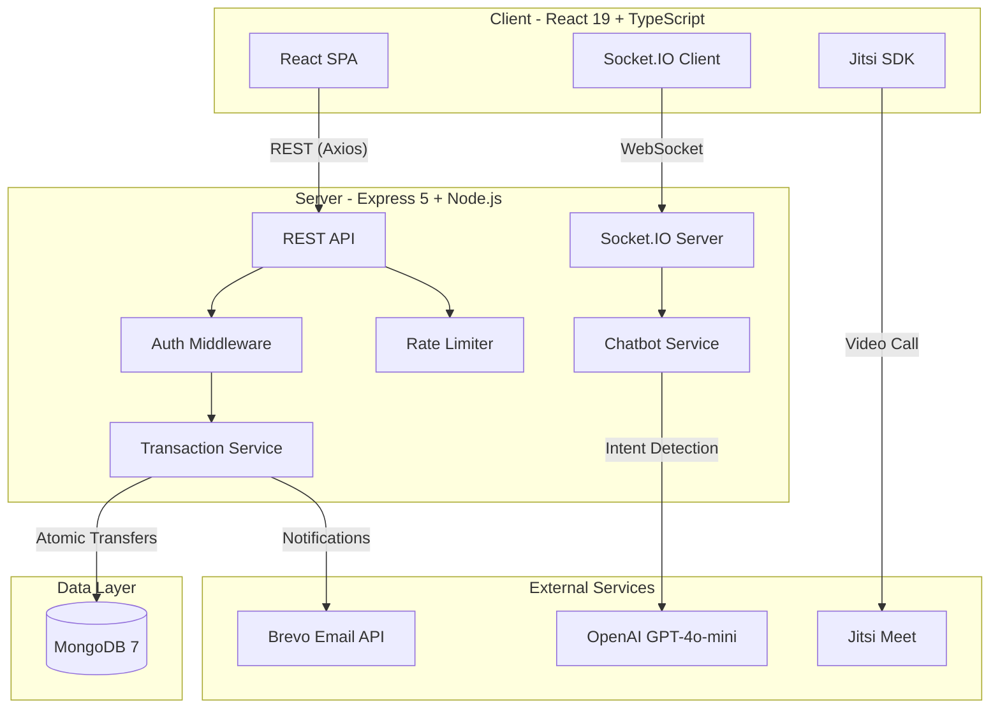
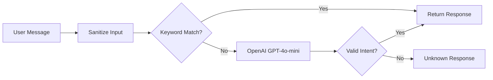

# Dubai-Bank -- Project Presentation

## 1. סקירה כללית

**Dubai-Bank** הוא אפליקציית בנקאות Full-Stack שנבנתה מאפס, הכוללת:
- העברות כספים אטומיות עם MongoDB Transactions
- צ'אטבוט חכם מבוסס OpenAI עם Socket.IO בזמן אמת
- שיחות וידאו (Jitsi Meet) בין משתמשים לאחר העברה
- מערכת אימות מלאה עם JWT, אימות אימייל, ו-Rate Limiting
- תשתית Docker מלאה עם Multi-Stage Builds

### Tech Stack

| שכבה | טכנולוגיות |
|-------|------------|
| **Frontend** | React 19, TypeScript, Vite 7, Material-UI 7, Socket.IO Client, Jitsi SDK |
| **Backend** | Node.js 20, Express 5, MongoDB 7 (Mongoose 8), Socket.IO, OpenAI SDK |
| **Security** | JWT (httpOnly cookies), bcrypt, Rate Limiting, Input Sanitization |
| **Infra** | Docker Compose, Nginx, Multi-Stage Builds, Winston Logging |
| **Testing** | Jest + Supertest (server), Vitest + Testing Library (client) |
| **3rd Party** | Brevo (Email), OpenAI GPT-4o-mini, Jitsi Meet |

### Architecture Diagram



---

## 2. העברות כספים אטומיות -- MongoDB Transactions

> זהו החלק הכי קריטי באפליקציית בנקאות: איך מבטיחים שהעברת כסף לא תשאיר את המערכת במצב לא עקבי.

### הבעיה
כשמעבירים כסף מחשבון A לחשבון B, צריך לבצע 3 פעולות:
1. להוריד יתרה מהשולח
2. להוסיף יתרה למקבל
3. ליצור רשומת טרנזקציה

אם הפעולה נכשלת באמצע (למשל, אחרי שהורדנו מהשולח אבל לפני שהוספנו למקבל) -- הכסף "נעלם". זהו בדיוק ה-Problem ש-ACID Transactions פותרים.

### הפתרון

```javascript
// server/src/services/transaction.service.js

export const executeTransfer = async (senderEmail, receiverEmail, amount, description) => {
  const session = await mongoose.startSession();
  session.startTransaction();
  try {
    if (receiverEmail.toLowerCase() === senderEmail.toLowerCase()) {
      throw new AppError('Cannot transfer to yourself', 400);
    }
    await deductSenderBalance(senderEmail, amount, session);
    await addReceiverBalance(receiverEmail, amount, session);
    const transaction = await createTransactionRecord(
      senderEmail, receiverEmail, amount, description, session,
    );
    await session.commitTransaction();
    return transaction;
  } catch (error) {
    await session.abortTransaction();
    throw error;
  } finally {
    session.endSession();
  }
};
```

### נקודות מפתח

**1. Atomic Balance Check (Race Condition Prevention):**
```javascript
const deductSenderBalance = async (senderEmail, amount, session) => {
  const sender = await User.findOneAndUpdate(
    { email: senderEmail, balance: { $gte: amount } },  // Check + Update in ONE atomic operation
    { $inc: { balance: -amount } },
    { session, new: true },
  );
  if (!sender) throw new AppError('Insufficient funds', 400);
};
```
בדיקת היתרה והורדתה מתבצעות **בפעולה אטומית אחת** -- אין פער זמן שבו שני requests יכולים "לראות" את אותה יתרה. ה-`$gte` בתנאי ה-query מבטיח שאם אין מספיק כסף, ה-update פשוט לא יקרה ונקבל `null`.

**2. Sequential Transaction IDs (Counter Collection):**
```javascript
// server/src/models/transaction.model.js

export const getNextTransactionId = async (session = null) => {
  const options = { new: true, upsert: true };
  if (session) options.session = session;

  const counter = await Counter.findByIdAndUpdate(
    'transactions',
    { $inc: { seq: 1 } },
    options,
  );
  return counter.seq;
};
```
במקום UUID או ObjectId, משתמשים ב-Counter Collection שמייצר מספרים רציפים (1, 2, 3...) -- יותר ידידותי למשתמש ומאפשר מיון טבעי. ה-Counter רץ **בתוך אותו MongoDB Session**, כך שאם הטרנזקציה נכשלת, גם ה-ID חוזר.

**3. Compound Indexes לביצועים:**
```javascript
transactionSchema.index({ fromEmail: 1, createdAt: -1 });
transactionSchema.index({ toEmail: 1, createdAt: -1 });
```
אינדקסים על `email + createdAt` מאפשרים שליפה מהירה של טרנזקציות לפי משתמש, ממוינות מהחדש לישן, בלי Full Collection Scan.

---

## 3. צ'אטבוט AI עם Hybrid Intent Detection

> פיצ'ר שמדגים אינטגרציה עם OpenAI, אבל עם גישה חכמה: לא כל הודעה שולחת קריאה ל-API.

### הארכיטקטורה: שתי שכבות זיהוי



**שכבה 1 -- Keyword Matching (מהיר, חינמי):**
```javascript
// server/src/services/chatbot.service.js

const KEYWORDS = {
  greeting: ['hello', 'hi'],
  balance: ['balance', 'money'],
  help:    ['help'],
  goodbye: ['bye', 'thank'],
};

const detectIntent = (message) => {
  const text = message.toLowerCase();
  for (const [intent, words] of Object.entries(KEYWORDS)) {
    if (words.some((w) => text.includes(w))) return intent;
  }
  return INTENTS.UNKNOWN;
};
```

**שכבה 2 -- OpenAI Fallback (חכם, בתשלום):**
```javascript
// server/src/services/openaiIntent.service.js

const ALLOWED_INTENTS = ['greeting', 'balance', 'help', 'goodbye', 'unknown'];

export const detectIntentWithAI = async (userText) => {
  const response = await client.chat.completions.create({
    model: 'gpt-4o-mini',
    messages: [
      { role: 'system', content: SYSTEM_PROMPT },
      { role: 'user', content: userText },
    ],
    max_tokens: 10,    // Single word response
    temperature: 0,     // Deterministic output
  });

  const normalizedIntent = content.trim().toLowerCase();
  return ALLOWED_INTENTS.includes(normalizedIntent) ? normalizedIntent : 'unknown';
};
```

### למה זה מעניין?

1. **אופטימיזציית עלויות**: רוב ההודעות (hi, help, balance) נתפסות ב-Keyword Matching -- בלי קריאה ל-OpenAI. רק הודעות מורכבות ("how much do I have in my account?") מגיעות ל-AI.

2. **Strict Validation**: גם אם OpenAI מחזיר תשובה לא צפויה, יש Whitelist שמוודא שרק intents מוכרים עוברים. כל דבר אחר הופך ל-`"unknown"`.

3. **אבטחה**:
```javascript
const sanitizeInput = (input) =>
  typeof input === 'string'
    ? input.trim().slice(0, 250).replace(/<[^>]*>/g, '')
    : '';

const SENSITIVE_INTENTS = ['balance'];

const isAuthorizedForIntent = (intent, userId) =>
  !isSensitiveIntent(intent) || !!userId;
```
- **Input Sanitization**: חיתוך ל-250 תווים, הסרת HTML tags (מניעת XSS)
- **Authorization per Intent**: רק משתמשים מחוברים יכולים לשאול על יתרה
- **User ID Masking**: `maskUserId(userId)` מציג רק 4 ספרות אחרונות (`****a1b2`)

---

## 4. ארכיטקטורת WebSocket בזמן אמת

> הצ'אטבוט רץ על Socket.IO עם אימות JWT בכל הודעה, מעקב אחר משתמשים מחוברים, וניתוק מסודר.

### Socket Authentication Middleware

```javascript
// server/src/middleware/socketAuth.middleware.js

export const authenticateSocket = async (socket, next) => {
  try {
    const cookieHeader = socket.handshake.headers?.cookie;
    const token = socket.handshake.auth?.token ?? getTokenFromCookie(cookieHeader);

    if (!token) return next(new Error('Authentication token is required'));

    const decoded = verifyToken(token);
    const user = await User.findOne({ id: decoded.id }).select('id email status');

    if (!user) return next(new Error('User not found'));
    if (user.status !== USER_STATUS.ACTIVE) return next(new Error('User account is not active'));

    socket.data.user = user;
    next();
  } catch (error) {
    const isJwtError = error.name === 'JsonWebTokenError' || error.name === 'TokenExpiredError';
    return next(new Error(isJwtError ? 'Invalid or expired authentication token' : 'Authentication failed'));
  }
};
```

### Multi-Socket Tracking + Re-Verification

```javascript
// server/src/socket/socket.handler.js

const activeSockets = new Map();  // userId -> Set<socket>

chatNamespace.on('connection', (socket) => {
  const userId = socket.data.user.id;

  // Track socket per user (supports multiple tabs/devices)
  if (!activeSockets.has(userId)) activeSockets.set(userId, new Set());
  activeSockets.get(userId).add(socket);

  socket.on('user-message', async (message) => {
    // Re-verify token on EVERY message (not just on connection)
    const token = getTokenFromCookie(socket.handshake.headers?.cookie);
    try {
      verifyToken(token);  // Throws if expired
    } catch (error) {
      if (error.name === 'TokenExpiredError' || error.name === 'JsonWebTokenError') {
        socket.emit('bot-message', { response: 'Session expired...', intent: 'error' });
        socket.disconnect();
        return;
      }
    }
    // ... process message
  });
});
```

### Disconnect on Logout
```javascript
export const disconnectUser = (userId) => {
  const sockets = activeSockets.get(userId);
  if (sockets) {
    sockets.forEach((socket) => {
      socket.emit('bot-message', { response: 'You have been logged out.', intent: 'error' });
      socket.disconnect();
    });
    activeSockets.delete(userId);
  }
};
```

### למה זה מעניין?

- **Re-verification per message**: לא מסתפקים באימות חד-פעמי בחיבור. בכל הודעה בודקים שה-JWT עדיין תקף -- מונע מצב שמשתמש עם טוקן שפג תוקף ממשיך לתקשר.
- **Multi-device support**: `Map<userId, Set<socket>>` מאפשר למשתמש להיות מחובר ממספר טאבים/מכשירים.
- **Clean logout**: כשמשתמש מתנתק, כל ה-sockets שלו מקבלים הודעה ומנותקים.

---

## 5. שכבת האבטחה

### 5.1 JWT בתוך httpOnly Cookie (לא localStorage)

```javascript
// server/src/config/index.js

cookie: {
  tokenName: 'token',
  maxAgeSeconds: 3600,
  sameSite: process.env.COOKIE_SAME_SITE || 'lax',
  secure: process.env.NODE_ENV === 'production',
},
```

**למה Cookie ולא localStorage?**
- `httpOnly` -- JavaScript לא יכול לגשת לטוקן (מונע XSS theft)
- `secure` -- נשלח רק ב-HTTPS (production)
- `sameSite` -- מגן מפני CSRF

הטוקן נשלח אוטומטית עם כל request, בלי שהצד-לקוח מטפל בו.

### 5.2 Dual Token Extraction (HTTP + WebSocket)

```javascript
// server/src/middleware/auth.middleware.js -- HTTP Requests

function getTokenFromRequest(req) {
  const cookieToken = req.cookies?.token;
  if (cookieToken) return cookieToken;

  const authHeader = req.headers.authorization;
  const parts = authHeader?.split(' ') ?? [];
  return parts[0]?.toLowerCase() === 'bearer' ? parts[1] : undefined;
}

// server/src/middleware/socketAuth.middleware.js -- WebSocket

const token = socket.handshake.auth?.token ?? getTokenFromCookie(cookieHeader);
```

שני ערוצי התקשורת (REST ו-WebSocket) תומכים בשני מקורות טוקן: Cookie (ברירת מחדל) ו-Bearer Header (fallback). זה מאפשר גמישות -- דפדפן שולח Cookie אוטומטית, כלי כמו Postman שולח Bearer.

### 5.3 Password Security

```javascript
// server/src/models/user.model.js
password: {
  type: String,
  required: true,
  minlength: 8,
  select: false,  // NEVER returned in queries by default
},

// server/src/services/user.service.js
const hashedPassword = await bcrypt.hash(password, SALT_ROUNDS); // 10 rounds
return bcrypt.compare(inputPassword, hashedPassword);            // Constant-time comparison
```

- `select: false` -- הסיסמה לא חוזרת בשום query אלא אם מבקשים במפורש עם `.select('+password')`
- bcrypt עם 10 rounds -- Hash + Salt אוטומטי
- `bcrypt.compare` -- השוואה בזמן קבוע (מונעת Timing Attacks)

### 5.4 Verification Token Hashing

```javascript
// server/src/services/user.service.js
const verificationToken = generateVerificationToken();
// Store HASHED token in DB
user.verificationToken = hashToken(verificationToken);
// Send PLAIN token to user email

// On verify:
const user = await User.findOne({ verificationToken: hashToken(token) });
```

הטוקן נשמר ב-DB כ-SHA-256 Hash. גם אם מישהו מקבל גישה ל-DB, הוא לא יכול לאמת חשבונות עם הטוקנים שם.

### 5.5 Rate Limiting -- אסטרטגיה מדורגת

```javascript
// server/src/middleware/rateLimit.middleware.js

authLimiter:        5 requests  / 15 minutes   // Login, Signup
verifyLimiter:      10 requests / 1 hour        // Email Verification
transactionLimiter: 10 requests / 1 minute      // Money Transfers
```

כל endpoint מקבל Rate Limit מותאם:
- **Auth**: הגנה מפני Brute Force (5 ניסיונות ב-15 דקות)
- **Verification**: מניעת spam של מיילי אימות
- **Transactions**: מניעת הצפה של העברות

> בסביבת development, ה-Auth Limiter מוגדר ל-999999 כדי לא להפריע בפיתוח.

---

## 6. Error Handling -- ארכיטקטורה מרכזית

### AppError + Error Mapper

```javascript
// server/src/utils/error.util.js

export class AppError extends Error {
  constructor(message, statusCode) {
    super(message);
    this.statusCode = statusCode;
  }
}

export const mapErrorToResponse = (error) => {
  // AppError (business errors) -- use as-is
  if (error.statusCode) {
    return { statusCode: error.statusCode, message: error.message };
  }
  // Mongoose ValidationError -- extract field messages
  if (error.name === 'ValidationError') {
    const messages = Object.values(error.errors).map((e) => e.message);
    return { statusCode: 400, message: messages.join(', ') };
  }
  // Duplicate Key (email already exists, etc.)
  if (error.code === 11000) {
    const field = Object.keys(error.keyPattern || {})[0] || 'field';
    return { statusCode: 409, message: `This ${field} is already registered` };
  }
  // Unknown -- hide internal details
  return { statusCode: 500, message: 'Internal server error' };
};
```

### למה זה מעניין?

- **Single Source of Truth**: כל ה-error handling עובר דרך פונקציה אחת
- **Safe by Default**: שגיאות לא מוכרות מחזירות הודעה גנרית (לא חושפות Stack Trace)
- **Smart Mapping**: שגיאות Mongoose (Validation, Duplicate Key) מתורגמות אוטומטית לתשובות HTTP מתאימות
- **Consistent Response Format**: כל שגיאה חוזרת כ-`{ success: false, error: "message" }`

---

## 7. Video Call עם Deterministic Room Names

> אחרי העברת כסף, המשתמש יכול לשלוח למקבל הודעה עם קישור לשיחת וידאו.

```javascript
// server/src/services/transaction.service.js

export const generateVideoCallRoomName = (email1, email2) => {
  const pair = [email1.toLowerCase(), email2.toLowerCase()].sort().join('|');
  return crypto.createHash('sha256').update(pair).digest('hex').slice(0, 16);
};
```

### למה Deterministic?

- **אותו זוג משתמשים תמיד מקבל את אותו חדר** -- לא משנה מי שלח ומי קיבל
- `.sort()` מבטיח ש-`(A,B)` ו-`(B,A)` מייצרים את אותו Hash
- SHA-256 מייצר מזהה ייחודי, 16 תווים ראשונים מספיקים לייחודיות
- הקישור נשלח באימייל דרך Brevo עם פרטי הטרנזקציה

---

## 8. ארכיטקטורת Client

### Feature-Based Structure

```
client/src/
  api/           -- HTTP client, services, auth storage
  screens/       -- Feature modules (login, dashboard, transfer, transactions)
  components/    -- Shared components (ChatAssistant, VideoCall)
  shared/        -- Hooks, formatters, theme
  layout/        -- AppHeader, PageFooter
  context/       -- Theme context
  types/         -- TypeScript interfaces
```

### useAsyncOperation -- Generic Hook

```typescript
// client/src/shared/useAsyncOperation.ts

export const useAsyncOperation = (initialLoading = false) => {
  const [loading, setLoading] = useState(initialLoading);
  const [error, setError] = useState('');

  const execute = useCallback(
    async (operation: () => Promise<any>, onSuccess?: (result: any) => void) => {
      setError('');
      setLoading(true);
      try {
        const result = await operation();
        if (onSuccess !== undefined) onSuccess(result);
        return { result, error: '' };
      } catch (err: unknown) {
        const errorMessage = getErrorMessage(err);
        setError(errorMessage);
        return { result: undefined, error: errorMessage };
      } finally {
        setLoading(false);
      }
    },
    []
  );

  return { loading, error, execute, setError: setErrorManually };
};
```

Hook גנרי שעוטף כל קריאה אסינכרונית עם מצבי loading/error. כל ה-hooks בפרויקט (`useLogin`, `useTransfer`, `useTransactions` וכו') משתמשים בו, מה שמבטיח התנהגות אחידה.

### Axios Interceptor -- Auto Logout on 401

```typescript
// client/src/api/http-client.ts

httpClient.interceptors.response.use(
  (res) => res,
  (err: AxiosError) => {
    if (err.response?.status === 401) {
      authStorage.clearAuth();  // Triggers AUTH_CHANGE_EVENT
    }
    return Promise.reject(err);
  }
);
```

### Auth State via Custom Event

```typescript
// client/src/api/auth.storage.ts

export const AUTH_CHANGE_EVENT = 'auth-state-change';

clearAuth() {
  localStorage.removeItem('user');
  window.dispatchEvent(new Event(AUTH_CHANGE_EVENT));
},
```

כשה-JWT פג תוקף (401), ה-Interceptor מנקה את ה-auth state ומפיץ Event. כל component שמאזין (כמו ChatAssistant) מגיב בהתאם -- בלי prop drilling ובלי Redux.

---

## 9. DevOps ותשתית

### Docker Compose -- Production Ready

```yaml
# docker-compose.yml
services:
  mongo:
    image: mongo:7
    healthcheck:
      test: ["CMD", "mongosh", "--eval", "db.adminCommand('ping')"]
      interval: 5s
      retries: 5

  server:
    build: ./server
    depends_on:
      mongo:
        condition: service_healthy  # Waits for MongoDB to be ready

  client:
    build: ./client                 # Multi-stage: Node -> Nginx
    ports:
      - "80:80"
```

- **Health Check**: ה-server לא עולה עד ש-MongoDB אישר שהוא תקין
- **Multi-Stage Build (Client)**: שלב 1 בונה עם Node.js, שלב 2 מגיש עם Nginx -- Image קטן יותר
- **Network Isolation**: הסרביסים מתקשרים דרך Docker Network פנימי

### Database Connection with Retry + Exponential Backoff

```javascript
// server/src/config/database.js

for (let attempt = 1; attempt <= MAX_RETRIES; attempt++) {
  try {
    await mongoose.connect(config.mongoUri);
    return;
  } catch (error) {
    if (attempt < MAX_RETRIES) {
      const delay = RETRY_DELAY_MS * Math.pow(2, attempt - 1);  // 2s, 4s, 8s, 16s...
      await sleep(delay);
    }
  }
}
process.exit(1);
```

### Graceful Shutdown

```javascript
// server/server.js

const shutdown = (signal) => {
  logger.info(`${signal} received, shutting down gracefully`);
  httpServer.close(() => {
    mongoose.connection.close(false).then(() => {
      process.exit(0);
    });
  });
};

process.on('SIGTERM', () => shutdown('SIGTERM'));
process.on('SIGINT', () => shutdown('SIGINT'));
```

סגירה מסודרת: קודם מפסיקים לקבל חיבורים חדשים, מחכים שחיבורים קיימים יסיימו, סוגרים את החיבור ל-MongoDB, ורק אז יוצאים.

### Configuration -- Immutable Config Object

```javascript
// server/src/config/index.js

validateRequiredEnvVars();  // Throws on startup if JWT_SECRET or MONGO_URI missing

const config = { /* ... */ };

Object.freeze(config.jwt);
Object.freeze(config.cookie);
Object.freeze(config.email);
Object.freeze(config);
```

- **Fail Fast**: אם חסרים משתני סביבה קריטיים, השרת לא עולה
- **Immutability**: `Object.freeze` מונע שינוי בטעות בזמן ריצה

---

## 10. Testing

### Server -- Jest + Supertest + In-Memory MongoDB

```
server/src/__tests__/
  integration/
    auth.routes.test.js          -- Signup, login, verification flows
    login.test.js                -- Login edge cases
    me.test.js                   -- Protected /me endpoint
    auth.middleware.test.js       -- Auth middleware behavior
    transactions.test.js         -- Transfer and listing flows
  unit/
    jwt.util.test.js             -- Token creation/verification
    validation.util.test.js      -- Amount validation
```

- **mongodb-memory-server**: מריץ MongoDB בזיכרון -- טסטים מהירים, מבודדים, ללא תלות בשרת חיצוני
- **Supertest**: בדיקות HTTP מלאות מ-request עד response

### Client -- Vitest + Testing Library

```
client/src/__tests__/
  api/
    auth.service.test.ts         -- Auth API calls
    http-client.test.ts          -- Interceptors, 401 handling
    transaction.service.test.ts  -- Transaction API calls
    user.service.test.ts         -- User API calls
    auth.storage.test.ts         -- localStorage + events
  hooks/
    useLogin.test.ts             -- Login hook behavior
    useSignup.test.ts            -- Signup hook behavior
    useTransfer.test.ts          -- Transfer hook behavior
    useDashboardData.test.ts     -- Dashboard data fetching
    useTransactions.test.ts      -- Pagination logic
    useTransactionDetail.test.ts -- Transaction detail loading
  unit/
    displayFormatters.test.ts    -- Number/date formatting
    timeBasedGreeting.test.ts    -- Time-based greeting logic
    useAsyncOperation.test.ts    -- Generic async hook
```

- **21 test files** בסה"כ (7 server + 14 client)
- כיסוי מלא: API layer, Custom Hooks, Utilities, Middleware, Integration flows

---

## סיכום -- "למה הפרויקט הזה מעניין?"

| תחום | מה מיוחד |
|------|----------|
| **Data Integrity** | MongoDB Transactions עם atomic balance check -- מונע race conditions |
| **AI Integration** | Hybrid intent detection -- keyword matching + OpenAI fallback עם cost optimization |
| **Real-Time** | Socket.IO עם JWT re-verification per message ו-multi-device tracking |
| **Security** | httpOnly JWT cookies, bcrypt, hashed verification tokens, tiered rate limiting |
| **Architecture** | Clean separation (Controller -> Service -> Model), centralized error handling |
| **DevOps** | Docker Compose עם health checks, multi-stage builds, graceful shutdown |
| **Testing** | 21 test files -- integration + unit, in-memory DB, custom hooks testing |
| **UX Features** | Video calls (Jitsi), email notifications (Brevo), dark mode, responsive design |
