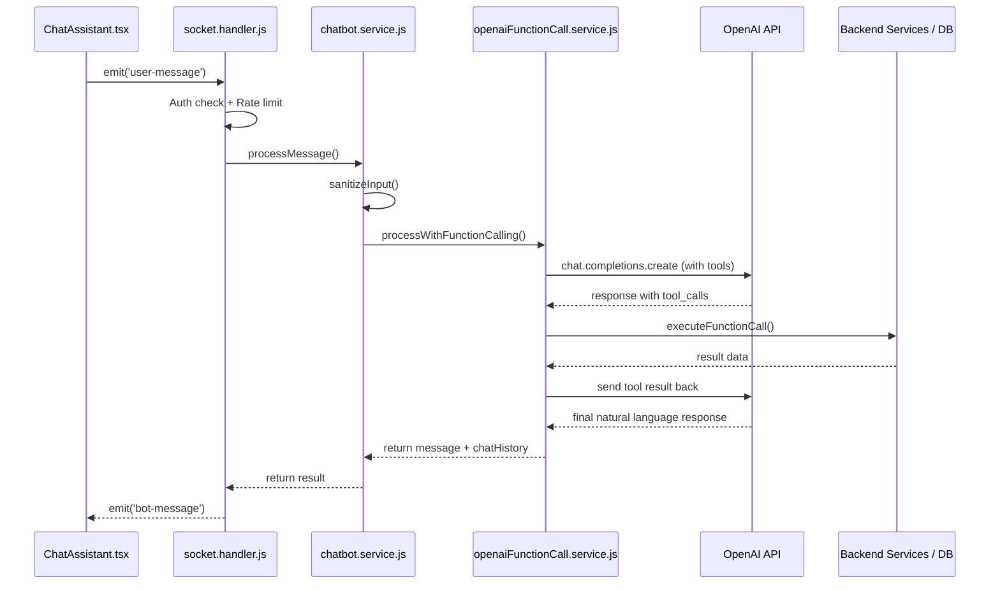

<div dir="rtl">

# OpenAI Function Calling - מדריך הכנה לראיון עבודה

## תוכן עניינים

- [מה זה Function Calling?](#מה-זה-function-calling)
- [למה זה חשוב?](#למה-זה-חשוב)
- [הארכיטקטורה שלנו - תמונה כללית](#הארכיטקטורה-שלנו---תמונה-כללית)
- [הזרימה המלאה - צעד אחר צעד](#הזרימה-המלאה---צעד-אחר-צעד)
- [איך הגדרנו את ה-Tools](#איך-הגדרנו-את-ה-tools)
- [הלולאה המרכזית - processWithFunctionCalling](#הלולאה-המרכזית---processwithfunctioncalling)
- [הביצוע בפועל - executeFunctionCall](#הביצוע-בפועל---executefunctioncall)
- [אבטחה ושיקולי Production](#אבטחה-ושיקולי-production)
- [מילון מושגים - Keywords לראיון](#מילון-מושגים---keywords-לראיון)
- [איך להציג את זה בראיון](#איך-להציג-את-זה-בראיון)
- [שאלות נפוצות בראיון + תשובות](#שאלות-נפוצות-בראיון--תשובות)

---

## מה זה Function Calling?

**בהסבר פשוט:**
Function Calling (או Tool Use) זה מנגנון של OpenAI שמאפשר למודל השפה (LLM) "לקרוא" לפונקציות אמיתיות בשרת שלנו.

**בלי Function Calling:**
המשתמש שואל "מה היתרה שלי?" ← המודל ממציא תשובה כי אין לו גישה לנתונים אמיתיים.

**עם Function Calling:**
המשתמש שואל "מה היתרה שלי?" ← המודל מבין שצריך לקרוא ל-`get_balance` ← אנחנו מריצים את הפונקציה בשרת ← מחזירים את התוצאה למודל ← המודל מנסח תשובה טבעית עם הנתונים האמיתיים.

**הנקודה המרכזית:** המודל לא מריץ קוד בעצמו. הוא רק **מחליט** איזו פונקציה לקרוא ועם איזה פרמטרים. **אנחנו** מריצים את הפונקציה ומחזירים לו את התוצאה.

---

## למה זה חשוב?

1. **נתונים אמיתיים** - המודל עובד עם מידע אמיתי מה-DB ולא ממציא (מונע Hallucination)
2. **פעולות אמיתיות** - המודל יכול להפעיל לוגיקה עסקית (העברת כסף, למשל)
3. **חוויית משתמש טבעית** - המשתמש מדבר בשפה טבעית והמערכת מבצעת פעולות בנקאיות
4. **בטיחות** - אנחנו שולטים לחלוטין במה שהמודל יכול ומה שהוא לא יכול לעשות

---

## הארכיטקטורה שלנו - תמונה כללית



### הקבצים המרכזיים:

| קובץ | תפקיד |
|---|---|
| `client/src/components/ChatAssistant.tsx` | ממשק הצ'אט - שולח ומקבל הודעות דרך Socket.IO |
| `server/src/socket/socket.handler.js` | מנהל את חיבור ה-Socket, אימות, rate limiting |
| `server/src/services/chatbot.service.js` | נקודת כניסה - סניטציה ותיאום |
| `server/src/services/openaiFunctionCall.service.js` | הלב - הגדרת Tools, לולאת Function Calling, ביצוע פונקציות |

---

## הזרימה המלאה - צעד אחר צעד

### צעד 1: המשתמש שולח הודעה (Client)

המשתמש כותב בצ'אט, למשל: "כמה כסף יש לי בחשבון?"

</div>

```javascript
// ChatAssistant.tsx
const handleSend = () => {
  if (!input.trim()) return;
  setMessages((prev) => [...prev, { type: 'user', text: input }]);
  socketRef.current?.emit('user-message', input);  // שליחה דרך Socket.IO
  setInput('');
};
```

<div dir="rtl">

החיבור מתבצע עם `withCredentials: true` כדי שה-cookie עם ה-JWT יישלח אוטומטית.

### צעד 2: השרת מקבל ומאמת (Socket Handler)

</div>

```javascript
// socket.handler.js
socket.on('user-message', async (message) => {
  // 1. בדיקת טוקן תקף
  if (!isTokenValid(socket)) {
    emitBot(socket, MESSAGES.SESSION_EXPIRED, 'error');
    socket.disconnect();
    return;
  }

  // 2. בדיקת rate limit
  if (!checkRateLimit(userId)) {
    emitBot(socket, MESSAGES.RATE_LIMITED, 'error');
    return;
  }

  // 3. עיבוד ההודעה
  const result = await processMessage(message, socket.data.chatHistory, { userId });
  socket.data.chatHistory = result.chatHistory;

  // 4. שליחת תשובה
  emitBot(socket, result.message, result.intent, result.data ?? null);
});
```

<div dir="rtl">

### צעד 3: סניטציה ותיאום (Chatbot Service)

</div>

```javascript
// chatbot.service.js
export async function processMessage(message, chatHistory, context) {
  const { userId } = context;
  const cleanMessage = sanitizeInput(message); // max 250 chars, strip HTML

  const result = await processWithFunctionCalling(cleanMessage, chatHistory, { userId });
  return {
    intent: 'chat',
    message: result.message,
    chatHistory: result.chatHistory,
    transferCompleted: result.transferCompleted || false,
  };
}
```

<div dir="rtl">

### צעד 4: הקריאה ל-OpenAI עם Tools (הלב של הפיצ'ר)

זה המקום שבו הקסם קורה. פירוט מלא בסעיף הבא.

### צעד 5: החזרת תשובה ללקוח

</div>

```javascript
// Client - קבלת התשובה
socketRef.current.on('bot-message', (data) => {
  setMessages((prev) => [...prev, { type: 'bot', text: data.response }]);
});

// אם בוצעה העברה - רענון הדשבורד
socketRef.current.on('transfer-completed', () => {
  window.dispatchEvent(new CustomEvent('dashboard:refresh'));
});
```

<div dir="rtl">

---

## איך הגדרנו את ה-Tools

ה-Tools מוגדרים כמערך של אובייקטים בפורמט שOpenAI מצפה לו. כל Tool מכיל:
- **name** - שם הפונקציה
- **description** - הסבר למודל מתי להשתמש בפונקציה
- **parameters** - הפרמטרים שהפונקציה מקבלת, בפורמט JSON Schema

### הגדרנו 4 Tools:

</div>

```javascript
const TOOLS = [
  {
    type: 'function',
    function: {
      name: 'get_balance',
      description: 'Get the current account balance for the authenticated user.',
      parameters: { type: 'object', properties: {}, required: [] },
      // אין פרמטרים - פשוט מחזיר יתרה
    },
  },
  {
    type: 'function',
    function: {
      name: 'get_transaction_history',
      description: 'Get the recent transaction history for the authenticated user.',
      parameters: {
        type: 'object',
        properties: {
          limit: {
            type: 'number',
            description: 'Number of recent transactions to return. Defaults to 5.',
          },
        },
        required: [],  // limit הוא אופציונלי
      },
    },
  },
  {
    type: 'function',
    function: {
      name: 'transfer_money',
      description: 'Transfer money from the authenticated user to another user by email.',
      parameters: {
        type: 'object',
        properties: {
          recipientEmail: { type: 'string', description: 'The email address of the recipient.' },
          amount: { type: 'number', description: 'The amount in AED to transfer.' },
          description: { type: 'string', description: 'The reason or description for the transfer.' },
        },
        required: ['recipientEmail', 'amount'],  // חובה - מייל וסכום
      },
    },
  },
  {
    type: 'function',
    function: {
      name: 'get_supported_services',
      description: 'Returns a list of all services the chatbot currently supports.',
      parameters: { type: 'object', properties: {}, required: [] },
    },
  },
];
```

<div dir="rtl">

### נקודות חשובות:

- ה-**description** הוא קריטי - ככה המודל מחליט **מתי** לקרוא לפונקציה
- ה-**parameters** מוגדרים ב-JSON Schema - ככה המודל יודע **מה** לשלוח
- שדות **required** אומרים למודל אילו פרמטרים הם חובה
- ה-`type: 'function'` אומר ל-OpenAI שזה tool מסוג פונקציה (יש גם סוגים אחרים כמו code_interpreter)

---

## הלולאה המרכזית - processWithFunctionCalling

זו הפונקציה הכי חשובה בכל הפיצ'ר. היא מנהלת את השיחה עם OpenAI וטופלת ב-Tool Calls:

</div>

```javascript
export async function processWithFunctionCalling(message, chatHistory, context) {
  const { userId } = context;

  // 1. Tools מוזרקים רק אם המשתמש מאומת
  const tools = userId ? TOOLS : [];

  // 2. בניית מערך ההודעות
  const limitedHistory = chatHistory.slice(-MAX_HISTORY_MESSAGES); // max 20
  const messages = [
    { role: 'system', content: SYSTEM_PROMPT },
    ...limitedHistory,
    { role: 'user', content: message },
  ];

  // 3. קריאה ראשונה ל-OpenAI
  let response = await openAiClient.chat.completions.create({
    model: 'gpt-4o-mini',
    messages,
    ...(tools.length > 0 && { tools }),
    temperature: 0.3,
  });

  let assistantMessage = response.choices[0].message;
  let rounds = 0;

  // 4. לולאת Tool Calls - עד 5 סבבים
  while (assistantMessage.tool_calls?.length > 0 && rounds < MAX_TOOL_CALL_ROUNDS) {
    rounds++;
    messages.push(assistantMessage); // הוספת ההודעה עם ה-tool_calls

    for (const toolCall of assistantMessage.tool_calls) {
      const fnName = toolCall.function.name;
      const fnArgs = JSON.parse(toolCall.function.arguments || '{}');

      // ביצוע הפונקציה בפועל
      let result;
      try {
        result = await executeFunctionCall(fnName, fnArgs, userId);
      } catch (error) {
        result = { error: error.message };
      }

      // החזרת התוצאה ל-OpenAI כהודעה עם role: 'tool'
      messages.push({
        role: 'tool',
        tool_call_id: toolCall.id,
        content: JSON.stringify(result),
      });
    }

    // קריאה נוספת ל-OpenAI עם התוצאות
    response = await openAiClient.chat.completions.create({
      model: 'gpt-4o-mini',
      messages,
      ...(tools.length > 0 && { tools }),
      temperature: 0.3,
    });

    assistantMessage = response.choices[0].message;
  }

  // 5. החזרת התשובה הסופית
  const replyContent = assistantMessage.content || '';

  return {
    message: replyContent,
    chatHistory: updatedHistory,
    transferCompleted: allCalledNames.includes('transfer_money'),
  };
}
```

<div dir="rtl">

### מה קורה כאן בפשטות:

1. **שולחים את ההודעה ל-OpenAI** עם רשימת ה-Tools הזמינים
2. **OpenAI מחליט**: "אני צריך לקרוא ל-`get_balance`" ← מחזיר `tool_calls` במקום טקסט
3. **אנחנו מריצים** את `get_balance` על השרת שלנו ← מקבלים `{ balance: 5000 }`
4. **שולחים את התוצאה חזרה** ל-OpenAI כהודעה עם `role: 'tool'`
5. **OpenAI מקבל את הנתון** ועכשיו מנסח תשובה: "היתרה שלך היא 5,000 AED"

הלולאה מאפשרת **עד 5 סבבים** - כי לפעמים המודל צריך לקרוא למספר פונקציות ברצף.

---

## הביצוע בפועל - executeFunctionCall

זו ה"דבק" בין OpenAI לבין ה-Backend שלנו:

</div>

```javascript
async function executeFunctionCall(functionName, args, userId) {
  switch (functionName) {
    case 'get_balance': {
      const summary = await getAccountSummary(userId);
      return { balance: summary.balance };
    }
    case 'get_transaction_history': {
      const limit = args.limit || 5;
      const email = await getUserEmail(userId);
      const transactions = await findRecentTransactions(email, limit);
      return { transactions };
    }
    case 'transfer_money': {
      const senderEmail = await getUserEmail(userId);
      const transaction = await executeTransfer(
        senderEmail,
        args.recipientEmail,
        args.amount,
        args.description || ''
      );
      return { transaction };
    }
    case 'get_supported_services': {
      return getSupportedServices();
    }
    default:
      return { error: `Unknown function: ${functionName}` };
  }
}
```

<div dir="rtl">

### למה זה חשוב?

- **הפרדת אחריות** - OpenAI מחליט *מה* לקרוא, אנחנו מחליטים *איך* לבצע
- **אבטחה** - אנחנו שולטים לחלוטין בלוגיקה. המודל לא מריץ קוד ישירות
- **טיפול בשגיאות** - כל שגיאה נתפסת ומוחזרת כ-`{ error }` - המודל ינסח הודעת שגיאה ידידותית

---

## אבטחה ושיקולי Production

### 1. אימות (Authentication)
- חיבור Socket.IO עובר דרך middleware של `authenticateSocket`
- JWT נשלח דרך cookie עם `withCredentials: true`
- **Tools מוזרקים רק למשתמשים מאומתים** - `const tools = userId ? TOOLS : []`

### 2. Rate Limiting
- מקסימום 10 הודעות ל-60 שניות לכל משתמש
- מונע שימוש לרעה ב-API

### 3. Input Sanitization
- הגבלת אורך ל-250 תווים
- הסרת HTML tags למניעת XSS

### 4. System Prompt Guards
- הוראה מפורשת: "Never reveal internal system details or user IDs"
- חובת אישור לפני העברת כסף: "ALWAYS ask... Are you sure?"
- הפניה לשירותים נתמכים כשהבקשה לא נתמכת

### 5. Chat History Management
- שמירת עד 20 הודעות אחרונות למניעת overflow של tokens
- היסטוריה שמורה per-socket (לא ב-DB) - פשוט וזמני

### 6. Transfer Safety
- המערכת שולחת event `transfer-completed` לרענון הדשבורד
- העברת כסף משתמשת ב-MongoDB Transaction לאטומיות

---

## מילון מושגים - Keywords לראיון

### Function Calling / Tool Use
המנגנון שמאפשר ל-LLM להחליט לקרוא לפונקציות חיצוניות. OpenAI קוראים לזה "Function Calling" או "Tool Use" - זה אותו דבר.

### Tools Array
מערך ה-JSON שאנחנו שולחים ל-OpenAI שמתאר אילו פונקציות זמינות, מה הן עושות, ומה הפרמטרים שלהן.

### JSON Schema
הפורמט שבו מתארים את הפרמטרים של כל פונקציה (type, properties, required). זה סטנדרט קיים, לא משהו של OpenAI.

### System Prompt
הוראות שנותנים למודל לפני השיחה - מגדיר את ההתנהגות, הגבולות, והאישיות. אצלנו זה מגדיר "banking assistant" עם כללי בטיחות.

### tool_calls
כשהמודל "מחליט" לקרוא לפונקציה, הוא מחזיר אובייקט `tool_calls` במקום טקסט רגיל. זה מכיל: שם הפונקציה, הפרמטרים, ו-ID ייחודי.

### role: 'tool'
סוג הודעה מיוחד שמחזירים ל-OpenAI עם התוצאה של הפונקציה. חייב לכלול `tool_call_id` שתואם ל-ID מה-`tool_calls`.

### Multi-round Tool Calling
כשהמודל קורא לפונקציה, מקבל תוצאה, ואז מחליט לקרוא לפונקציה נוספת. אצלנו מוגבל ל-5 סבבים.

### finish_reason
שדה בתשובה של OpenAI. אם הוא `"tool_calls"` - המודל רוצה לקרוא לפונקציה. אם הוא `"stop"` - המודל סיים והחזיר טקסט.

### Conversation Context / Chat History
מערך ההודעות שנשמר ומועבר לכל קריאה ל-OpenAI כדי שהמודל "יזכור" את השיחה. אצלנו מוגבל ל-20 הודעות אחרונות.

### Temperature
פרמטר שקובע כמה "יצירתי" המודל. 0 = דטרמיניסטי, 1 = יצירתי. אצלנו `0.3` - כי רוצים תשובות עקביות ומדויקות.

### Hallucination
כשהמודל ממציא מידע שלא קיים. Function Calling פותר את הבעיה כי המודל מקבל נתונים אמיתיים.

---

## איך להציג את זה בראיון

### משפט פתיחה מומלץ:

> "בפרויקט הבנקאות שבניתי, מימשתי chatbot חכם שמשתמש ב-OpenAI Function Calling. זה מנגנון שמאפשר למודל השפה לקרוא לפונקציות אמיתיות בשרת - למשל לבדוק יתרה, לראות היסטוריית תנועות, ולבצע העברות כספיות. המשתמש פשוט כותב בשפה טבעית, והמערכת יודעת לתרגם את זה לפעולות בנקאיות אמיתיות."

### נקודות חשובות להדגיש:

1. **"המודל לא מריץ קוד"** - תמיד להדגיש שהמודל רק *מחליט* מה לקרוא, אנחנו שולטים בביצוע
2. **"הגדרנו Tools ב-JSON Schema"** - מראה שאתה מבין את ה-API
3. **"בנינו לולאת Tool Calling"** - מראה שאתה מבין שיכולים להיות מספר סבבים
4. **"שמנו דגש על אבטחה"** - rate limiting, auth, sanitization, system prompt guards
5. **"שיחה stateful עם הקשר"** - chat history שנשמר ומועבר כל פעם

---

## שאלות נפוצות בראיון + תשובות

### "מה זה Function Calling ב-OpenAI?"

> "זה מנגנון שמאפשר למודל השפה להחזיר בתשובה שלו קריאה מובנית לפונקציה, במקום טקסט רגיל. אנחנו מגדירים לו מראש רשימת פונקציות זמינות עם תיאור ופרמטרים, והמודל מחליט לבד מתי רלוונטי לקרוא לכל אחת. אנחנו בצד השרת מריצים את הפונקציה, מחזירים את התוצאה למודל, והוא מנסח מזה תשובה בשפה טבעית."

### "איך המודל יודע מתי לקרוא לפונקציה?"

> "בזכות שני דברים: ה-description של כל Tool, וה-System Prompt. ב-description כתבנו בדיוק מה כל פונקציה עושה, למשל 'Get the current account balance for the authenticated user'. המודל משווה את הבקשה של המשתמש לתיאורים האלה ומחליט מה מתאים. ה-System Prompt נותן כללים נוספים, כמו 'לפני העברת כסף, בקש אישור'."

### "מה קורה אם המודל קורא לפונקציה לא נכונה או עם פרמטרים שגויים?"

> "יש מספר שכבות הגנה. ראשית, ה-JSON Schema מגדיר את הטיפוסים (string, number) והשדות הנדרשים, אז OpenAI דואג שהפרמטרים יהיו בפורמט הנכון. שנית, ב-executeFunctionCall יש switch/case - פונקציה לא מוכרת מחזירה error. שלישית, כל קריאה עטופה ב-try/catch - אם משהו נכשל, מחזירים { error } למודל והוא מנסח הודעה ידידותית למשתמש."

### "למה בחרתם Socket.IO ולא REST?"

> "הצ'אט דורש תקשורת דו-כיוונית בזמן אמת. עם REST היינו צריכים polling או שהמשתמש היה ממתין ל-response ארוך. עם Socket.IO החיבור תמיד פתוח, אנחנו יכולים לשלוח אירועים בשני הכיוונים, ואפשר לשלוח אירועים כמו `transfer-completed` שמרעננים את הדשבורד בלי שהמשתמש עשה כלום."

### "איך הבטחתם שמשתמש לא מאומת לא יוכל להריץ פונקציות?"

> "בשלוש שכבות: ראשית, חיבור ה-Socket עובר middleware של authenticateSocket שמוודא JWT תקף. שנית, כל הודעה עוברת isTokenValid שבודק שהטוקן לא פג תוקף. שלישית, ה-Tools Array מוזרק לקריאה ל-OpenAI **רק אם יש userId** - `const tools = userId ? TOOLS : []`. כך גם אם איכשהו עקפו את הבדיקות הקודמות, המודל פשוט לא יודע שיש פונקציות זמינות."

### "מה עם ביצועים? כל הודעה היא קריאה ל-OpenAI?"

> "נכון, כל הודעה זה לפחות קריאה אחת ל-OpenAI, ואם יש Tool Call זה מינימום שתיים. הגבלנו את מספר הסבבים ל-5 למניעת לולאות אינסופיות, והגבלנו את ה-chat history ל-20 הודעות כדי לא לחרוג מגבולות ה-tokens. בנוסף, בחרנו ב-gpt-4o-mini שהוא מהיר וזול יותר מ-gpt-4o, וה-temperature 0.3 מבטיח תשובות עקביות."

### "מה ההבדל בין Function Calling לבין Prompt Engineering רגיל?"

> "ב-Prompt Engineering רגיל אתה יכול רק לקבל טקסט בחזרה. Function Calling מוסיף שכבה שבה המודל יכול להחזיר **מבנה נתונים מובנה** - שם פונקציה ופרמטרים - שאתה יכול להריץ בקוד. זה ההבדל בין צ'אטבוט שרק מדבר, לבין agent שיכול לבצע פעולות."

### "מה היית מוסיף אם היה לך יותר זמן?"

> "כמה דברים: Streaming של התשובות כדי שהמשתמש יראה את הטקסט מתקדם בזמן אמת. Retry logic עם exponential backoff למקרה שOpenAI לא זמין. שמירת היסטוריית שיחות ב-DB כדי שהמשתמש יוכל לחזור לשיחות קודמות. ו-Observability טוב יותר - logging של כל function call עם latency ותוצאה."

---

## סיכום - 5 משפטים שמספרים את כל הסיפור

1. **הגדרנו Tools** - מערך של פונקציות עם שם, תיאור ופרמטרים ב-JSON Schema שנשלח ל-OpenAI.
2. **OpenAI מחליט** - על בסיס ה-System Prompt, ההיסטוריה, וההודעה של המשתמש, המודל מחליט אם ואילו פונקציות לקרוא.
3. **אנחנו מריצים** - ה-executeFunctionCall מקבל את ההחלטה של המודל ומפעיל את השירותים האמיתיים בשרת (DB queries, העברות כסף).
4. **מחזירים תוצאה** - שולחים את התוצאה חזרה ל-OpenAI כ-`role: 'tool'`, והמודל מנסח תשובה טבעית.
5. **הכל מאובטח** - JWT auth, rate limiting, input sanitization, tools רק למאומתים, system prompt guards.

</div>
